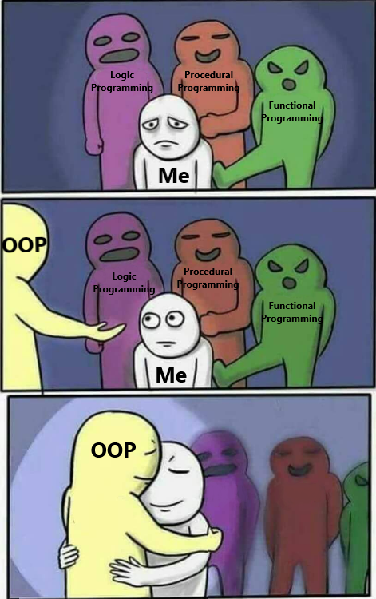

## Object Oriented Programming Course
This repository contains solutions to exercises for Object Oriented Programming course at the University of Science and Tehnology.
[Laboratory content](https://github.com/apohllo/obiektowe-lab).

This code became the basis for the project at the end of the course - [Evolution Simulation](https://github.com/MaOlszewska/Evolution-Simulation).

